<h1 align="center">🚍 Aditya Transport Hub (ATH)</h1>
<h3 align="center">A Smart MERN Stack + IoT-based Transport Management System</h3>

<p align="center">
  <a href="https://adityatransporthub.vercel.app" target="_blank">
    🔗 Live Demo
  </a>
</p>

---

## 📌 Overview

Aditya Transport Hub (ATH) is a **MERN Stack + IoT-based Smart Transport Management System** developed to manage university or institutional bus transport operations efficiently. It enables **real-time GPS tracking**, **automated boarding logs**, and **role-based dashboards** for Admins, Drivers, and Students.

---

## 🖼️ Screenshots

### Login Page:
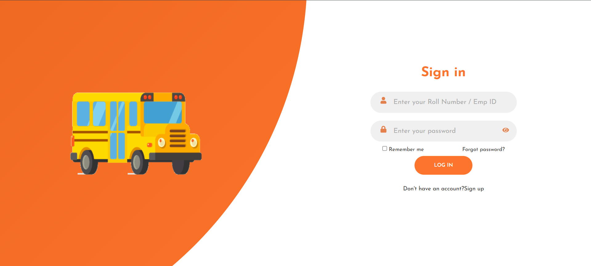

### Bus Animation for Authentication:


### Signup Page:


### User Details


### Home Page
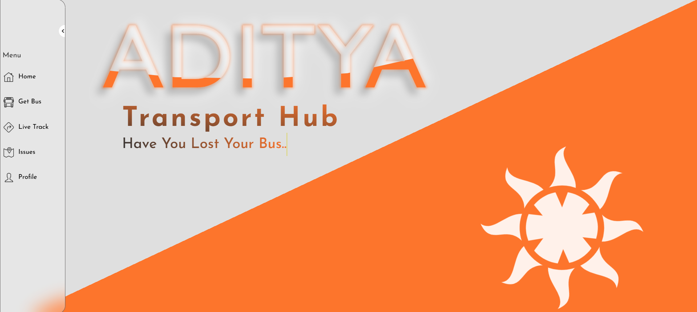

### Get My Bus Page
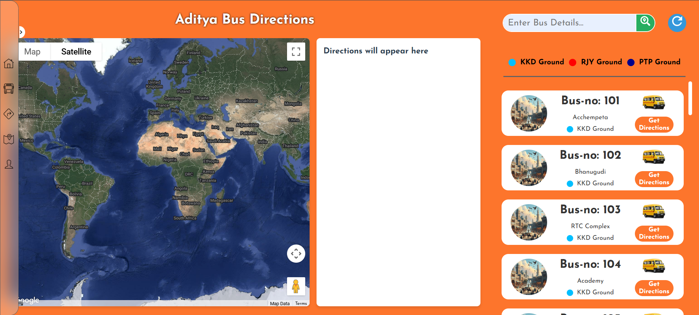

### Directions to Bus No. 103
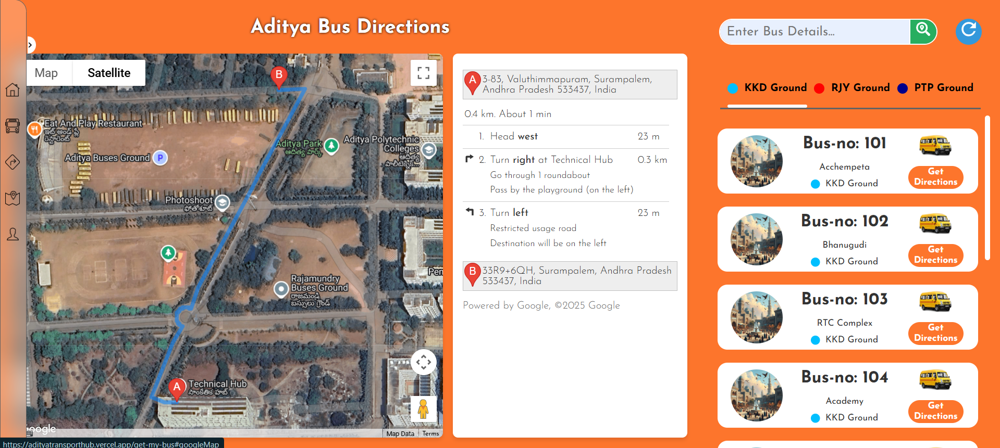

### Directions to Bus No. 205
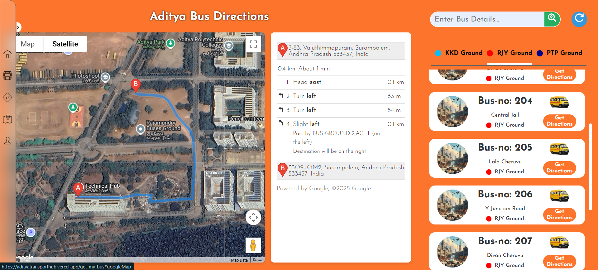

### Directions to Bus No. 407
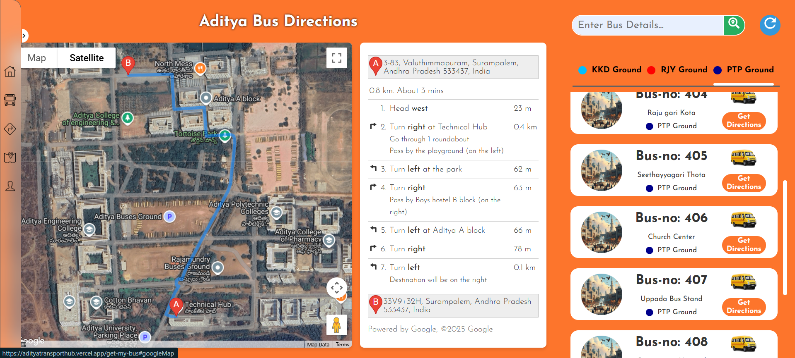

### Live Bus Tracking of Bus No. 312
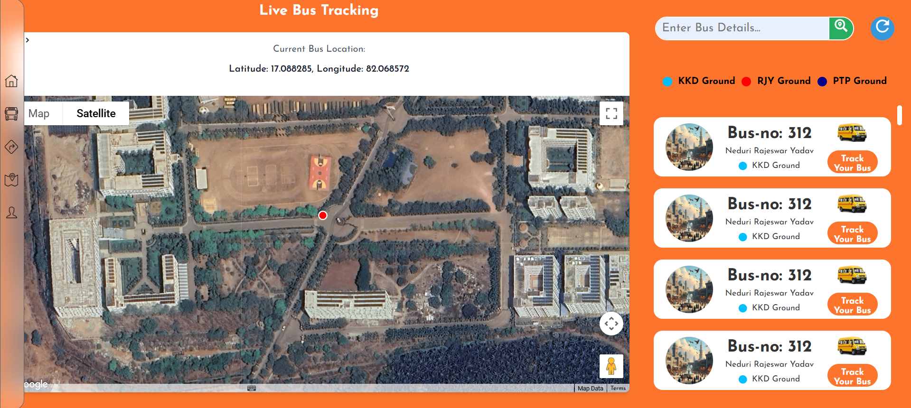
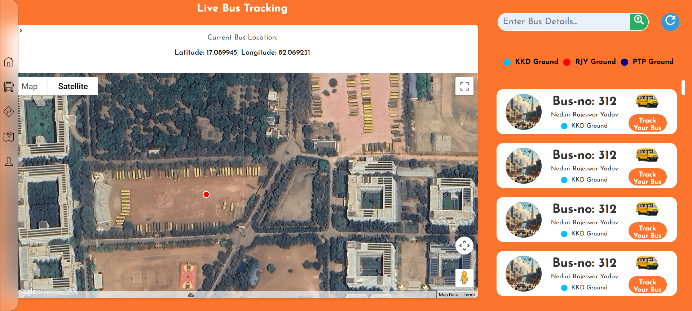
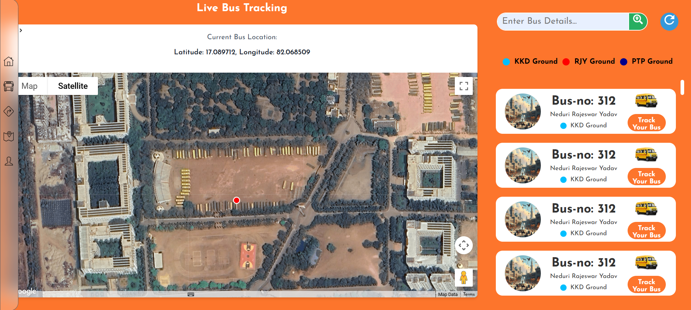

### Issues/ Feedback Form
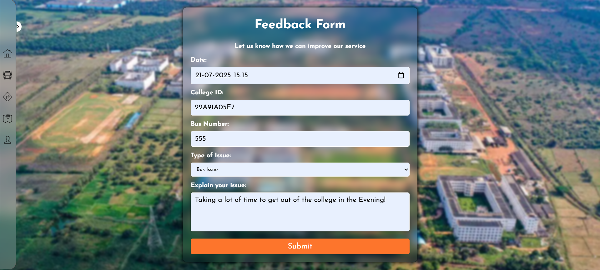

### Error 404 - Not Found
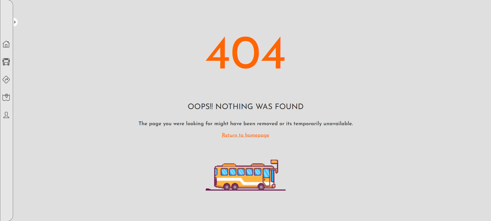
---


## 🧠 Key Features

- 🧑‍💼 **Role-Based Dashboards** – Admin, Driver, and Student
- 🚌 **Real-Time Bus Tracking** – Integrated with GPS modules
- 📍 **Route Mapping** – Using Google Maps API / OpenStreetMap
- 🧾 **Digital Boarding Logs** – Auto-updated with timestamps
- 📊 **Analytics Dashboard for Admin**
- 📨 **Contact and Feedback Form with Email Integration**

---

## 🔧 Tech Stack

| Technology | Description |
|------------|-------------|
| **Frontend** | React.js, HTML5, CSS3, JavaScript |
| **Backend**  | Node.js, Express.js |
| **Database** | MongoDB |
| **IoT Integration** | GPS Module for Live Bus Status |
| **Authentication** | JWT, Bcrypt |
| **Deployment** | Vercel (Frontend), Render (Backend) |

---

## 🌐 Live Demo

▶️ [https://adityatransporthub.vercel.app](https://adityatransporthub.vercel.app)

---

###  Clone the Repository

```bash
git clone https://github.com/nryadav18/ath.frontend.git
cd ath.frontend
